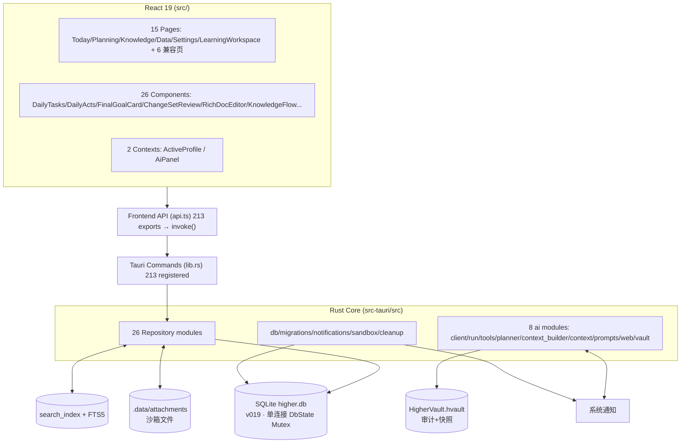
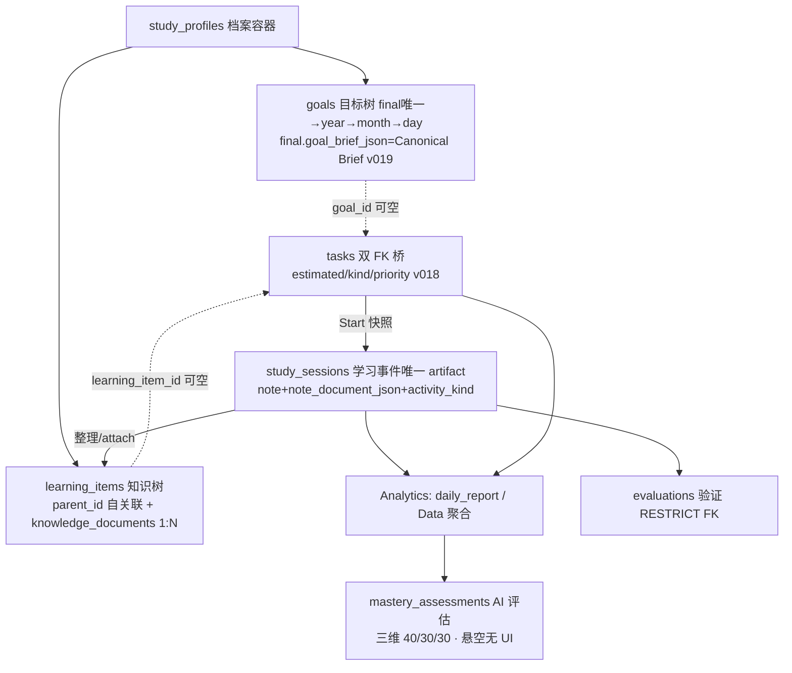

# HIGHER ARCHITECTURE MAP

> Full-System Truth Audit 产物 · 2026-08-17 · 基线 Schema v019 · 全部 CONFIRMED 含 Evidence（文件:行/符号）

## Diagram 1 · Overall System



文本链：`UI → api.ts(invoke) → lib.rs #[tauri::command] → repository/* → SQLite`；侧路：`ai/*（Provider/搜索/记忆/ChangeSet）、search（FTS5）、vault（审计）、attachments（沙箱）、notifications（plugin）`。Evidence：lib.rs:5124-5365 注册表；api.ts 213 export；repository/ 26 模块。

## Diagram 2 · Learning Core（真实关系修正版）



关键修正（vs TASK 假想链）：Knowledge 并非 Session 的下游，而是**并列实体**（Session=学习事件；knowledge_documents=长期文档，v016 "禁止为建文档伪造 Session"）；Mastery 在 Analytics 之后但**当前无 UI 入口**（LearningDataPanel 孤儿组件）。Evidence：v016:2-4；knowledge_workspace.rs:73-106；audit J66。

## Diagram 3 · Dual Tree Relationship

```text
study_profiles (唯一强制容器)
 ├── GOAL TREE (goals 自关联) —— 回答"什么时候完成什么"
 │    final（每档案唯一 idx_goals_final_unique；禁删；goal_brief_json=Canonical 七字段）
 │      └ year（period 可跨年[仅 AI/ChangeSet 链路]；repo 链路=自然年※两链不一致）
 │           └ month（"YYYY-MM" 必须落在父年）
 │                └ day（"YYYY-MM-DD" 必须落在父月；day_kind study|rest；rest 禁任务）
 │    legacy goals（v015 迁移：多 Goal 存档→最小 id 为 final 其余标 legacy，单列不入树）
 ├── KNOWLEDGE TREE (learning_items 自关联) —— 回答"需要掌握什么"
 │    root → 任意层级（sort_order 手动序；reorder_siblings）
 │    每节点 ──< knowledge_documents（1:N 用户文档；v016 迁移自旧 content）
 │             ──< learning_attachments（item 级）
 ├── TASK = 双树桥：goal_id(SET NULL) + learning_item_id(CASCADE) + plan_id(SET NULL) + recurring_rule_id(无FK)
 ├── SESSION = 三引用快照：task_id + goal_id + learning_item_id（start 时复制，之后独立演化不漂移）
 │           ──< learning_attachments（session 级）
 ├── EVALUATIONS：goal_id + learning_item_id(RESTRICT)——不挂 session
 ├── ATTACHMENTS：learning_item_id | session_id | document_id 三宿主
 └── AI 层（conversations/messages/runs/sources、memory、personalization、change_sets、search）全 profile_id 直挂
```

Evidence：goal.rs:313-443（expect_parent 层级链）；changeset.rs:425-519（ChangeSet 侧同校验+年不重叠）；learning_item.rs:356-396（move 只改 parent 不改 id→Session 引用稳定）；v013:22-40/98-141。两链 year 不一致：goal.rs:334-340 vs changeset.rs:1088-1092。

## Diagram 4 · AI Intelligence

```mermaid
flowchart TB
  U[用户消息 AiPanel.send] --> SR[ai_start_run\nRunManager.register]
  SR --> CT[run_chat_turn spawn]
  CT --> CB[Context Builder 五层 60k\nL1 当前上下文+final goal / L2 私人化(命中段落)\nL3 Higher FTS 12条 / L4 Memory12+历史对话6 / L5 工具期动态]
  CB --> INT{planning_write_intent?}
  INT -- 咨询 --> GEN[通用指令 readonly/assistant]
  INT -- 规划写 --> GS[read_goal_state]
  GS -- conflicts --> CF[❌ 目标冲突·需用户确认·终止]
  GS -- missing --> CL[❓ Clarification ≤5问·同会话]
  GS -- ready --> PD[PLAN_DRAFT_INSTRUCTION\n+Brief+当前日期]
  GEN --> LOOP[工具循环 ≤6轮 17 tools\nREAD14/WEB2/PROPOSAL1/DIRECT-WRITE 0]
  PD --> LOOP
  LOOP --> STREAM[chat_stream → ai://delta]
  STREAM --> PARSE{PlanDraft JSON?}
  PARSE -- ok --> VAL[validate_plan_draft\n层级/日∈月/rest无task/超载/重复/粒度/占位]
  VAL -- errors --> F1[❌ plan_validation_failed]
  VAL -- ok --> COMP[compile_to_changeset_ops\nF0→Y→M→K→D→T · ref前向 · ≤120ops]
  COMP --> CSC[ChangeSetRepository.create\nwaiting_approval]
  CSC --> EMIT[ai://changeset → Review UI]
  EMIT --> AP{用户审批}
  AP -- apply --> TX[apply 事务 resolve_refs→apply_one→commit\n+vault 审计+快照]
  AP -- reject/undo --> RJ[rejected/undone]
  TX --> DB[(正式数据落地)]
  CT --> MEM[Memory Extract 二次调用 ≤5条]
  MEM --> MT[(memory_records)]
```

Evidence：planner.rs 全模块；lib.rs:3578-3975（run_chat_turn+Planning 分支）、3844-3857（工具 propose 路径）、3100-3117（apply）；tools.rs:531-549（allowlist）；context_builder.rs:15-125。

## Diagram 5 · Data Lifecycle

```text
STUDY（学）→ RECORD（记）→ ARCHIVE（归）→ ANALYZE（析）→ ADJUST（调）

STUDY  : Workspace 富编辑（Tiptap：正文/H2/H3/列表/图片/视频/画图/代码块；900ms debounce autosave）
RECORD : end_session → ended_at+duration+completed（不自动完成任务；笔记 flush 前置）
ARCHIVE: End Sheet 五选项（attach 知识/新建子节点/追加正文/整理/仅保留）+ Completion 反馈（真实数据）
ANALYZE: Today 日报 / Calendar 月聚合 / Data 六块（后端聚合）/ mastery（AI，悬空）
ADJUST : AI Planning Pipeline（Conflict→Clarify→PlanDraft→Validate→Compile→ChangeSet→Apply）/
         Feedback→Adjustment（Knowledge 页主线）→ Relearn 生成任务
```

每步真实符号见 FULL_SYSTEM_AUDIT §10-16 与 §27。
