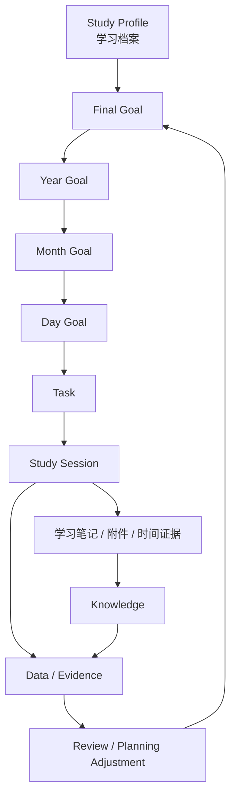
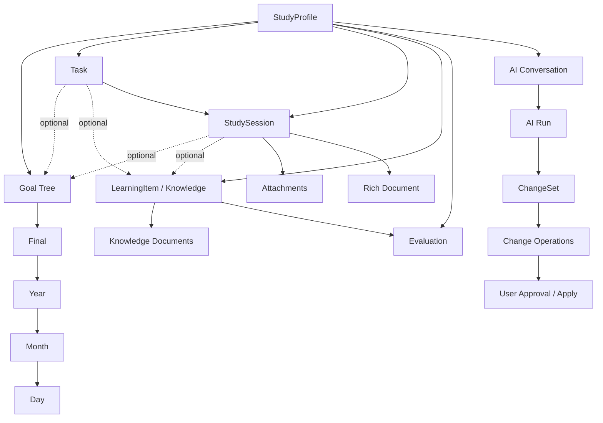
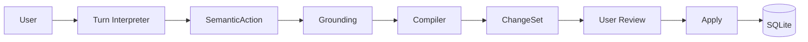
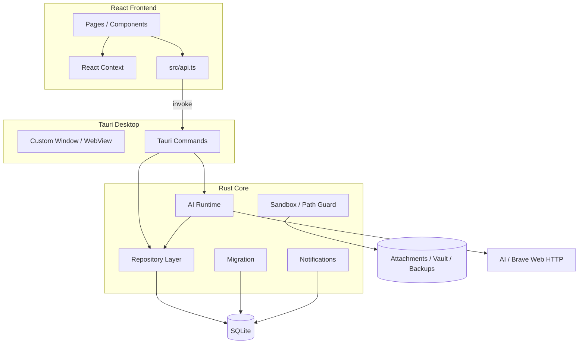
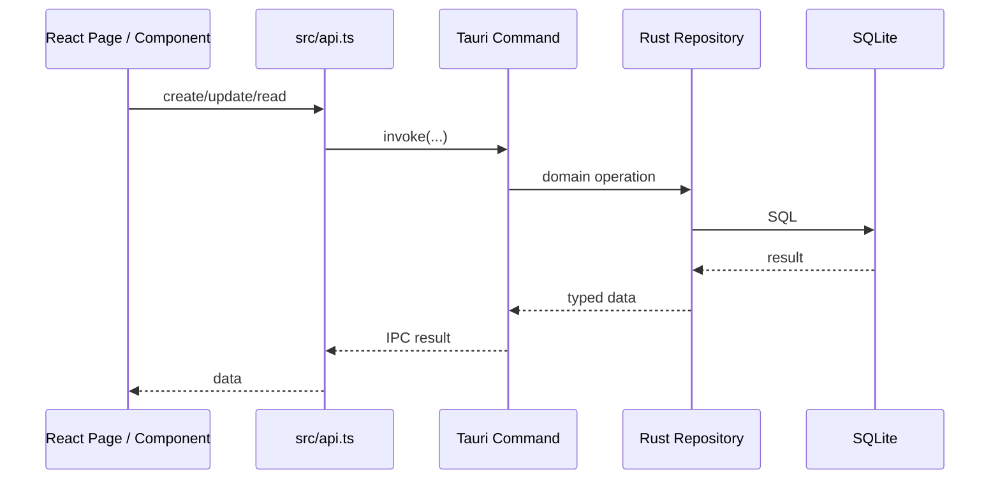

<p align="center">
  
</p>

<h1 align="center">Higher</h1>

<p align="center">
  <strong>一个本地优先、学习优先、用户自主、AI 辅助的个人学习系统。</strong>
</p>

<p align="center">
  Higher 把「目标 → 规划 → 任务 → 真实学习 → 知识沉淀 → 数据反馈 → 调整方向」连接成一个长期学习闭环。
</p>

---

# 目录

- [1. 先用 3 分钟理解 Higher](#1-先用-3-分钟理解-higher)
- [2. 当前项目状态](#2-当前项目状态)
- [3. Higher 的产品原则](#3-higher-的产品原则)
- [4. 当前用户界面](#4-当前用户界面)
- [5. 核心领域模型](#5-核心领域模型)
- [6. Profile：学习数据世界的边界](#6-profile学习数据世界的边界)
- [7. Goal Tree：什么时候完成什么](#7-goal-tree什么时候完成什么)
- [8. Task 与 Study Session](#8-task-与-study-session)
- [9. Knowledge：长期知识与真实学习历史](#9-knowledge长期知识与真实学习历史)
- [10. Evaluation / Feedback / Adjustment / Mastery](#10-evaluation--feedback--adjustment--mastery)
- [11. Higher AI：AI 理解语言，Higher 保证执行](#11-higher-aiai-理解语言higher-保证执行)
- [12. AI Multi-Provider 架构](#12-ai-multi-provider-架构)
- [13. Personal Intelligence 与正式规划 Truth](#13-personal-intelligence-与正式规划-truth)
- [14. 系统技术架构](#14-系统技术架构)
- [15. 技术栈](#15-技术栈)
- [16. 前端代码怎么读](#16-前端代码怎么读)
- [17. Rust / Tauri 后端怎么读](#17-rust--tauri-后端怎么读)
- [18. SQLite 与 Migration](#18-sqlite-与-migration)
- [19. 数据到底保存在哪里](#19-数据到底保存在哪里)
- [20. 外观、壁纸与 Desktop Shell](#20-外观壁纸与-desktop-shell)
- [21. 学习提醒](#21-学习提醒)
- [22. 搜索、联网、附件与路径安全](#22-搜索联网附件与路径安全)
- [23. 开发环境快速启动](#23-开发环境快速启动)
- [24. 测试与回归](#24-测试与回归)
- [25. Windows Release](#25-windows-release)
- [26. 开发仓库与用户安装包不是一回事](#26-开发仓库与用户安装包不是一回事)
- [27. 第一次接手 Higher 应该按什么顺序读](#27-第一次接手-higher-应该按什么顺序读)
- [28. 给 AI / Developer 的关键红线](#28-给-ai--developer-的关键红线)
- [29. 兼容层与已知技术债](#29-兼容层与已知技术债)
- [30. 一句话记住 Higher](#30-一句话记住-higher)

---

# 1. 先用 3 分钟理解 Higher

Higher 不是一个 Todo List，也不是一个纯笔记软件。

它想解决的是一个更长的过程：

```text
我最终想达到什么？
↓
这段长期周期要做到什么？
↓
这个月要做到什么？
↓
今天应该做什么？
↓
我实际上学了什么？
↓
这些学习沉淀成了什么知识？
↓
当前真实状态怎么样？
↓
下一步应该继续、调整还是复盘？
```

Higher 当前的核心闭环：



最重要的理解：

```text
Task = 我计划做什么
Study Session = 我实际上做了什么
Knowledge = 我长期留下了什么
AI = 帮助理解、分析、提案
User = 最终决定者
```

---

# 2. 当前项目状态

当前源码事实：

| 项目 | 当前状态 |
|---|---|
| 应用版本 | `1.0.0` |
| Release 状态 | `release/1.0.0` freeze candidate；最终 tag 待 Human Runtime |
| 桌面框架 | Tauri 2 |
| 前端 | React + TypeScript + Vite |
| 后端 | Rust |
| 数据库 | SQLite |
| Schema | `v024`，24 个顺序 Migration |
| 平台主线 | Windows Desktop（x64） |
| Bundle | NSIS（轻量安装包） |
| Product Name | `Higher` |
| Identifier | `com.higher.desktop` |
| Main Binary | `Higher.exe` |
| 当前 WebView2 安装策略 | `downloadBootstrapper`（不再内嵌离线 WebView2 载荷） |
| 数据策略 | Local First |
| AI | Primary AI + optional Control AI |
| AI Adapter | DeepSeek / OpenAI Compatible |
| AI 正式写入 | 必须经 ChangeSet + 用户批准 |
| 云账号 / 云同步 | 当前没有 |

> 版本：1.0.0；Release 状态：`release/1.0.0` freeze candidate，最终 tag 待 Human Runtime。

---

# 3. Higher 的产品原则

## 3.1 引导，不控制

Higher 可以：

- 理解用户；
- 分析状态；
- 给出建议；
- 生成规划；
- 提出数据修改方案。

但最终决定权属于用户。

Higher 不应该变成：

```text
强制学习流程
强制目标体系
强制知识体系
强制 AI 使用
```

---

## 3.2 Profile First

学习档案 `StudyProfile` 是 Higher 正式学习数据的顶层容器。

例如：

```text
2027 考研
AI Agent 技术成长
英语长期学习
某项资格考试
```

档案名称只是场景名：

> **Profile Name ≠ Final Goal**

---

## 3.3 Study First

用户随时应该可以开始学习。

因此：

```text
Goal Optional
Knowledge Optional
AI Optional
```

即使用户：

- 没建 Goal；
- 没建 Knowledge；
- 没配置 AI；

仍然可以通过：

```text
快速学习
```

直接产生真实 Study Session。

---

## 3.4 Archive Later

Higher 的方向是：

```text
先把真实学习留下来
↓
以后再整理
```

Quick Study 可以产生未归类 Session。

之后用户再决定：

```text
是否关联 Knowledge
是否关联 Goal
是否整理为长期文档
```

---

## 3.5 User Controlled Knowledge

知识体系由用户控制。

AI 可以提出：

```text
新增节点
调整结构
整理 Session
生成 Knowledge 修改建议
```

但是必须走：

```text
Proposal
→ ChangeSet
→ 用户审查
→ Apply
```

未经批准，不允许改变正式知识结构。

---

## 3.6 Evidence Based

Higher 尽量显示真实数据，而不是装饰性评分。

主产品不鼓励：

```text
努力分
专注分
效率分
无意义排行榜
XP
为了好看制造的 0%
```

例如某项数据没有证据时：

```text
未评估 ≠ 0 分
暂无计划 ≠ 0%
```

---

## 3.7 Local First

Higher 当前没有账号和云同步主线。

正式学习数据默认保存在本地。

设计倾向：

```text
RAM 尽量轻
真实学习历史尽量完整留盘
```

---

# 4. 当前用户界面

当前主导航由真实 `src/Layout.tsx` 定义：

```text
学习
├─ 今日
├─ 规划
└─ 知识

洞察
└─ 数据

────────────
设置（Sidebar 底部独立入口）
```

源码中真实存在的导航分组只有「学习」和「洞察」两个 group label。
「设置」不属于名为「系统」的导航分组，而是固定在 Sidebar 底部的独立入口。

右侧还有：

```text
Higher AI
```

它是全局 AI Panel，不是一个普通导航页面。

---

## 4.1 今日 `/`

回答：

> **“我现在要做什么？今天实际学了什么？”**

真实页面核心只有两个主区：

```text
今日任务
今日活动
```

主要功能：

- 快速学习；
- 新建任务；
- AI 安排；
- 今日任务查看 / 编辑 / 完成 / 开始；
- 当前进行中学习；
- 今日真实 Study Session；
- 阶段复盘提醒；
- 风险提示；
- AI 复盘今天。

Today 刷新时还会：

```text
materialize recurring tasks
同步未来重复任务
对齐学习提醒
```

---

## 4.2 规划 `/planning`

回答：

> **“方向与节奏对不对？”**

当前真实内容：

```text
Formal Planning Truth
Final Goal Card
Goal Tree
Next Step
Week View
Month View
选中日期 Daily Report
Task Create / Edit
Planning Review
```

重要：

> **Week 只是 Planning 的 UI View，不存在 Week Goal 数据层。**

Goal Tree 仍然是：

```text
Final
→ Year
→ Month
→ Day
```

---

## 4.3 知识 `/knowledge`

回答：

> **“我需要掌握什么？我已经沉淀了什么？”**

当前 Knowledge 页是真正的工作区，不只是树。

主要包含：

```text
Knowledge Tree
Knowledge Workspace
Knowledge Graph
Knowledge Documents
Study Session Timeline
附件
Evaluation
Feedback
未归类学习
```

当前 UI 有两个主要视图：

```text
工作区
知识图
```

---

## 4.4 数据 `/data`

回答：

> **“我的长期学习积累成什么样？”**

当前真实展示：

```text
累计
├─ 学习天数
├─ 累计时长
└─ 日均时长

今天
├─ 今日学习
└─ 今日任务

趋势
├─ 日
├─ 周
├─ 月
└─ 年

时间去哪了
└─ Knowledge 时间分布，可下钻

学习时段
└─ 7 个时间段

计划 vs 实际
└─ 最近 14 天
```

Data 页不把“综合效率”作为主产品评分。

---

## 4.5 设置 `/settings`

当前真实源码中有 **8 个 Tab**：

```text
学习档案
外观
AI 设置
私人化部署
联网搜索
学习提醒
数据管理
审计与备份
```

这 8 个 Tab 来自当前 `src/pages/Settings.tsx`，不是历史文档推测。

---

## 4.6 学习工作区 `/learn/:sessionId`

这里代表：

> **一次真实学习正在发生。**

主要能力：

- Session 标题；
- 学习计时；
- Tiptap 富文本笔记；
- 900ms debounce 自动保存；
- 图片 / 视频 / 文件 / 画图附件；
- 修正学习时间；
- 结束学习；
- 删除 Session；
- AI 分析本次学习；
- AI 帮助整理知识；
- 结束后关联到 Knowledge；
- 保留未归类；
- 创建后续 Task。

---

# 5. 核心领域模型

Higher 不是“一堆页面”，真正重要的是领域模型。



---

# 6. Profile：学习数据世界的边界

`StudyProfile` 是 Higher 的本地学习容器，不是云账号。

当前类型定义：

```text
id
name
profile_type
target_description
target_date
current_situation
notes
status
metadata
...
```

支持的 Profile 模板类型：

```text
考研
考公
职业 / 资格考试
专业技术提升
技能学习
语言学习
自定义
```

这些模板用于初始化 / UI 语义，不应该把 Higher 写死成某一种考试软件。

---

## 6.1 哪些数据以 Profile 为正式作用域？

核心学习数据基本都带 Profile Scope，例如：

```text
Goals
Tasks
Study Sessions
Knowledge Items
Knowledge Documents
Evaluations
Feedbacks
Adjustments
AI Conversations
AI Messages
AI Pending Actions
Formal Goal Targets
Planning Blueprints
```

---

## 6.2 哪些配置是软件级而不是 Profile 级？

当前源码中存在软件级配置，例如：

```text
AI Provider Connections
Primary / Control AI 选择
部分 Settings KV
Appearance Theme
Wallpaper
AI Panel UI 状态
```

因此不要把：

> **“学习数据按 Profile 隔离”**

误解为：

> **“Higher 里的任何设置都必须按 Profile 保存。”**

---

# 7. Goal Tree：什么时候完成什么

Higher 用户可见 Goal Tree：

```text
Profile
└─ Final Goal
   └─ Year Goal
      └─ Month Goal
         └─ Day Goal
```

所有层级仍然复用同一 `goals` 模型，通过：

```text
parent_goal_id
goal_level
period_start
period_end
sort_order
```

形成树。

---

## 7.1 Final Goal

每个 Profile 有一个 Canonical Final Goal 根。

当前产品约束：

- 每 Profile 唯一；
- 自动存在占位 Final Goal；
- 不能把 Profile Name 当最终目标；
- Final Goal 的结构化语义由 `goal_brief_json` 承担；
- `brief.title` 是正式语义标题；
- 历史字段仍保留用于兼容。

---

## 7.2 Year Goal

Year 并不强制等于自然年。

它代表：

> **长周期规划阶段**

例如：

```text
2026-08 → 2027-08
```

是合法产品语义。

---

## 7.3 Month / Day

```text
Month 必须属于 Year 周期
Day 必须属于 Month
```

Task 可以关联某个 Goal，也可以完全没有 Goal。

所以：

```text
Goal Tree = 方向组织
不是学习权限系统
```

---

# 8. Task 与 Study Session

这是理解 Higher 最重要的一组区别。

## Task

```text
“我计划做什么”
```

例如：

```text
今晚 20:00 学习高数 60 分钟
```

Task 当前可以包含：

```text
planned_date
planned_time
estimated_minutes
task_kind
priority
goal_id
learning_item_id
recurring_rule_id
status
```

---

## Study Session

```text
“我实际上学了什么”
```

例如：

```text
20:13 开始
21:02 结束
真实学习 49 分钟
写了富文本笔记
放了两张图片
关联到「高数 > 极限」
```

Session 才是真实 Learning Artifact。

---

## 8.1 Task ≠ Evidence

用户计划了 60 分钟，不代表真的学习了 60 分钟。

所以 Higher 需要保留：

```text
Plan Truth
≠
Learning Reality
```

Data 页的“计划 vs 实际”也是基于这个区别。

---

## 8.2 Quick Study

Quick Study 不要求：

```text
Goal
Knowledge
Task
```

它可以直接创建 Session。

结束后用户再决定是否归档。

---

## 8.3 Active Session Guard

当前 Higher 不允许在已有 Active Session 时无脑再开始第二次学习。

后端会返回结构化：

```text
ActiveSessionConflict
```

前端通过：

```text
ActiveSessionConflictModal
```

让用户处理冲突。

---

## 8.4 Session 时长可信度

真实记录也可能异常。

例如：

> 忘记点击结束，导致 Session 超长。

Higher 当前有：

```text
duration_review_state
```

典型状态：

```text
normal
needs_review
confirmed
corrected
```

明显异常时长不会自动偷偷改写，而是要求用户确认或修正。

---

# 9. Knowledge：长期知识与真实学习历史

Higher 中需要区分：

```text
LearningItem
KnowledgeDocument
StudySession
```

---

## 9.1 LearningItem

代表：

> **一个知识主题 / 知识树节点。**

例如：

```text
数学
└─ 高等数学
   └─ 极限
```

---

## 9.2 KnowledgeDocument

代表：

> **用户长期维护的正式知识文档。**

当前支持 Tiptap JSON + 纯文本投影。

Knowledge Document 可以有自己的附件。

---

## 9.3 StudySession

代表：

> **某一次真实学习的原始记录。**

它不是 Knowledge Document 的副本。

---

## 9.4 一个知识节点真正包含什么？

更接近：

```text
Knowledge Item：极限
├─ Document：极限定义整理
├─ Document：常见题型
├─ Session：2026-08-20 晚上学习
├─ Session：2026-08-21 复习
└─ Evaluation / Feedback
```

所以：

> **Knowledge = 长期文档 + 真实学习历史。**

---

## 9.5 未归类学习

Quick Study 产生且尚未关联 Knowledge 的 Session 会进入：

```text
未归类学习
```

这是一个虚拟入口，不是一个真正 Knowledge Node。

整理时只是建立关联：

> **不复制 Session。**

---

# 10. Evaluation / Feedback / Adjustment / Mastery

Higher 还存在完整的学习反馈链。

```text
Study Evidence
↓
Evaluation
↓
Feedback
↓
Adjustment
↓
Task / Relearn
```

---

## Evaluation

表示一次验证 / 检查证据。

---

## Feedback

表示：

> 从学习证据中确认出来、值得后续处理的问题。

当前问题类型包括：

```text
薄弱点
错误
卡点
问题记录
```

---

## Adjustment

表示：

> 对 Feedback 作出的调整决策。

当前包括：

```text
重新学习
增加练习
重新安排
调整计划
其他
```

Adjustment 不是第二套 Task 系统。

真正执行仍然落到 Task。

---

## Mastery

后端存在 AI Mastery 能力，包括：

```text
understanding
coverage
verification
```

但当前产品主界面没有把 Mastery 作为 Data 页主入口。

因此：

> **后端存在 ≠ 当前主 UI 已经产品化。**

---

# 11. Higher AI：AI 理解语言，Higher 保证执行

Higher AI 的最重要原则：

```text
LLM understands language
Higher validates execution
```

以及：

```text
AI Direct Write = 0
Pre-Approval Formal Mutation = 0
```

---

## 11.1 AI 不允许直接写数据库

用户说：

```text
“把我今天那个背单词改成 40 分钟”
```

模型不应该直接输出：

```text
task_id = 123
UPDATE tasks ...
```

模型只能理解语义。

---

## 11.2 Typed SemanticAction

当前 Semantic Contract 是：

```text
v2
```

模型可产生的核心 Action 包括：

```text
create_task
update_task
set_task_status
delete_task

create_recurring_task
update_recurring_task
set_recurring_enabled
delete_recurring_rule

bulk_update_tasks
```

Action 中禁止让模型生成数据库 ID。

目标引用是类似：

```text
title_hint
date
status_hint
recency_hint
quantity
scope_hint
```

---

## 11.3 Runtime Time Truth

“今天”“明天”“星期几”不能让模型自己猜。

前端每轮传入：

```text
local_date
local_datetime
timezone_offset
page_date
```

Rust 后端验证后生成：

```text
AiRuntimeEnvelope
```

模型只输出 symbolic temporal intent：

```text
today
tomorrow
yesterday
offset_days
absolute_date
weekday_relative
```

最终日期由 Higher 确定性计算。

---

## 11.4 Turn Interpreter

当前 AI 控制层不是简单关键词分流。

每轮通过 Turn Interpreter 决定：

```text
FastChat
HigherRead
Action
Planning
PlannerContinuation
Clarification
```

如果 route 是 Action：

> **同一次控制请求必须给出完整 Typed SemanticAction。**

避免第二次模型调用重新猜动作。

---

## 11.5 Grounding

自然语言引用不等于数据库 ID。

用户可能说：

```text
“那个任务”
“刚才那个”
“第一个”
“今天所有没完成的”
“每天那个 408”
```

Higher 通过 Grounding：

```text
Reference Hint
↓
Candidate Retrieval
↓
Canonical Candidate
```

典型结果：

```text
唯一候选 → 命中
多个候选 → 澄清
零候选   → Not Found
当前值已满足 → Nothing To Change
```

禁止为了让流程继续而瞎猜 ID。

---

## 11.6 Pending Action / Stable Continuation

候选澄清不是存在聊天 prose 里。

当前 v024 有正式表：

```text
ai_pending_actions
```

作用域：

```text
profile_id + conversation_id
```

每个 Profile + Conversation 最多一个 active Pending Action。

所以：

```text
用户说“第一个”
↓
Higher 可以恢复上一轮真实候选
↓
确定性继续
```

它不应该通过重新阅读一大段聊天文本来猜。

---

## 11.7 Compiler → ChangeSet

Grounding 之后：

```text
SemanticAction
↓
Grounded Action Plan
↓
Domain Compiler
↓
ProposedOp[]
↓
ONE ChangeSet
```

批量修改也应该进入同一个 ChangeSet。

---

## 11.8 用户批准

最终流程：



如果用户没有 Apply：

```text
Formal Data Mutation = 0
```

---

# 12. AI Multi-Provider 架构

Higher 当前不是写死单一模型。

---

## 12.1 AI Connection

一条 Connection 包含：

```text
display_name
adapter_kind
base_url
api_key
model
thinking_mode
enabled
capabilities
compatibility_status
```

当前 Adapter：

```text
DeepSeek
OpenAI Compatible
```

---

## 12.2 Primary AI

负责主要回答与需要 Primary 能力的流程。

---

## 12.3 Control AI

负责：

```text
Turn Interpreter
Action Understanding
Structured Control
```

Control AI 默认：

```text
Follow Primary
```

也可以单独指定。

---

## 12.4 Provider Adapter 边界

Provider-specific 行为集中在：

```text
src-tauri/src/ai/provider.rs
```

领域层：

```text
Task
Session
Goal
Knowledge
ChangeSet
```

不应该知道“这是 DeepSeek 还是别的厂商”。

---

## 12.5 Compatibility Probe

Higher 会检测 Connection 能力：

```text
Basic Chat
Structured JSON
JSON Strategy
Tool Calls
Streaming
Temperature Zero
```

Compatibility 状态：

```text
untested
full
limited
incompatible
```

如果能力不够：

> **明确拒绝相关功能，而不是悄悄切换 Provider。**

---

## 12.6 No Hidden Provider Fallback

当前产品约束：

```text
Primary 不可用
≠ 自动换另一个 Provider

Control 不可用
≠ 偷偷回退 Primary
```

唯一合法的“跟随”是：

```text
Control = Follow Primary
```

这是显式配置语义。

---

## 12.7 API Key

当前 AI Connection 的 API Key：

```text
本地明文保存在 Higher SQLite
Settings 中可查看 / 编辑
```

它不是云端 Secret Store。

因此：

> **绝对不要把用户 DB 或 API Key 打进 Git / Installer / Release。**

---

# 13. Personal Intelligence 与正式规划 Truth

Higher 当前同时存在用户可见 Goal Tree 和更深一层 AI Formal Planning Truth。

不要随意把两者混成一个概念。

---

## 13.1 四层事实模型

```text
StudyProfile
= 我当前在哪个学习世界

PersonalProfile
= 我是谁 / 我的能力 / 时间 / 约束 / 习惯

GoalTarget
= 我要去哪

PlanningBlueprint
= 我准备怎么去
```

---

## 13.2 Legacy Final Goal / GoalBrief

用户可见 Goal Tree 仍然保留：

```text
Final / Year / Month / Day
```

但 AI Formal Planning 当前把：

```text
GoalTarget
```

作为正式目标 Truth。

Legacy Goal / Profile target 字段：

```text
可以成为候选或历史证据
不能自动覆盖 Formal GoalTarget
```

---

## 13.3 Personalization

设置中的“私人化部署”当前支持：

```text
导入个人资料
↓
本地解析
↓
AI Compile 成 Personal Profile Draft
↓
用户确认
↓
AI Context 使用
```

真实导入格式包括：

```text
txt
md
docx
pdf
xlsx
```

并支持导出个人档案。

---

## 13.4 Planning Blueprint

Higher 存在正式规划结构：

```text
planning_blueprints
planning_phases
planning_milestones
planning_reviews
```

用户的长期规划不能只依赖聊天文本保存。

---

# 14. 系统技术架构

Higher 是：

> **React WebView + Tauri IPC + Rust Core + SQLite Local Data**



---

# 15. 技术栈

以下版本来自当前 lockfile / 当前源码。

## Frontend

| 技术 | 当前版本 | 作用 |
|---|---:|---|
| React | 19.2.8 | UI |
| React DOM | 19.2.8 | React DOM runtime |
| TypeScript | 7.0.2 | 类型系统 |
| Vite | 8.2.1 | Dev Server / Build |
| React Router DOM | 7.18.2 | HashRouter 路由 |
| Tauri JS API | 2.11.1 | WebView → Desktop API |
| Tiptap React | 3.30.1 | 富文本编辑器 |
| XYFlow / React Flow | 12.11.3 | Knowledge Graph |
| Recharts | 3.10.1 | Data 图表 |
| React Markdown | 10.1.0 | AI Markdown |
| ExcelJS | 4.4.0 | XLSX 导出 |
| docx | 9.7.1 | DOCX 导出 |

项目还安装了 `@radix-ui/themes`，但当前主 UI 主要由 Higher 自己的：

```text
styles.css
components
CSS variables / design tokens
```

实现，不应假设所有界面都建立在 Radix Theme 组件上。

---

## Desktop / Rust

核心依赖：

| 技术 | 作用 |
|---|---|
| Tauri 2 | Desktop Shell / IPC / Bundle |
| Rust 2021 | 后端业务核心 |
| rusqlite | SQLite |
| reqwest + rustls | AI / Web HTTP |
| serde / serde_json | 序列化 |
| tauri-plugin-dialog | 系统文件选择 |
| tauri-plugin-notification | Windows 学习提醒 |
| tauri-plugin-opener | 外部 URL |
| uuid | Runtime IDs |
| sha2 | Hash |
| quick-xml | XML 文档解析 |
| miniz_oxide | ZIP / Office 等解析辅助 |
| encoding_rs | 文本编码 |
| base64 | 文件 / 导出传输 |

Higher 当前没有使用大型 Agent Framework。

AI Runtime 是 Higher 自己维护的领域运行时。

---

# 16. 前端代码怎么读

前端入口：

```text
src/main.tsx
```

调用链：

```text
main.tsx
↓
App.tsx
↓
ActiveProfileProvider
↓
WallpaperLayers
↓
DesktopTitlebar
↓
ProfileGate
↓
HashRouter
↓
Layout
↓
Pages
```

---

## 16.1 当前主路由

真实 `App.tsx`：

```text
/                  Today
/planning          Planning
/knowledge         Knowledge
/data              Data
/learn/:sessionId  LearningWorkspace
/settings          Settings
```

兼容 / 内部路由：

```text
/review       → /planning?date=...
/progress     → /planning
/items        → /knowledge（存在 goal 参数时透传为 /knowledge?goal=...）

/goals
/tasks
/evaluations
/history
```

后面几项保留作兼容 / 技术入口，不在主导航展示。

---

## 16.2 前端主要目录

```text
src/
├─ main.tsx
├─ App.tsx
├─ Layout.tsx
├─ api.ts
├─ types.ts
├─ styles.css
│
├─ pages/
├─ components/
├─ contexts/
├─ appearance/
├─ lib/
└─ utils/
```

---

## 16.3 `src/api.ts` 是 IPC 总入口

前端不要在各 Component 中到处直接写：

```text
invoke("some_rust_command")
```

当前项目把大量 Tauri IPC 封装集中在：

```text
src/api.ts
```

典型链路：



如果要追一个功能，`src/api.ts` 是最重要的桥。

---

## 16.4 React 状态

当前没有引入：

```text
Redux
MobX
Zustand
```

Profile Gate 主要通过：

```text
ActiveProfileContext
```

管理。

AI Panel 有自己的：

```text
AiPanelContext
```

---

# 17. Rust / Tauri 后端怎么读

Rust 入口：

```text
src-tauri/src/main.rs
```

极薄：

```text
app_lib::run()
```

真正的 Desktop App setup 和大量 Tauri Command 位于：

```text
src-tauri/src/lib.rs
```

---

## 17.1 `lib.rs`

当前职责很多：

```text
Tauri App Setup
Window 创建
DB 初始化
Attachment Root
Vault
Notifications
大量 Tauri Commands
AI Run orchestration
ChangeSet application
```

这是当前真实架构，不要假设项目已经拆成独立 commands/ service 模块。

---

## 17.2 Repository Layer

正式数据库操作主要位于：

```text
src-tauri/src/repository/
```

当前包括：

```text
study_profile
goal
goal_target
task
study_session
learning_item
knowledge_document
knowledge_workspace
evaluation
feedback
adjustment
recurring_rule
planning
planning_review
planning_source
conversation
memory
personalization
changeset
ai_pending_action
ai_provider_profile
attachment
search
setting
cleanup
...
```

新业务写入应优先进入 Repository / Domain 结构，而不是把 SQL 随意散落到前端。

---

## 17.3 AI Runtime

AI 代码主要位于：

```text
src-tauri/src/ai/
```

关键文件：

```text
runtime.rs              时间真值 / Turn Interpreter / Routing
semantic_contract.rs    Semantic Contract v2 唯一协议源
action.rs               Typed Action / Plan / Compiler
grounding.rs            Entity Grounding / Candidate
action_continuation.rs  Pending Action continuation
provider.rs             Provider Adapter
compatibility.rs        Compatibility Probe
client.rs               HTTP Chat Client
context_builder.rs      Higher Context
context.rs              Legacy AI Context Builder（Compatibility Adapter）
prompts.rs              System Prompt / 写意图关键词检测
planner.rs              Formal Planning
tools.rs                Read Tool / ChangeSet proposal tool
run.rs                  Run Manager
trace.rs                Runtime trace
web.rs                  Brave Search / Web Open / SSRF Guard
vault.rs                Audit / Snapshot
skills/                 编译进程序的 SKILL.md
```

---

# 18. SQLite 与 Migration

Higher 使用：

```text
SQLite
```

并通过：

```text
src-tauri/src/migrations/
```

维护数据库 lineage。

当前：

```text
v001
...
v024
```

共 24 个 Migration。

---

## 18.1 Migration 的意义

Migration 是用户数据历史的一部分。

因此：

```text
升级 Higher
≠
删除 higher.db
```

正确方式：

```text
旧 DB
↓
检测 schema version
↓
顺序执行缺失 migration
↓
继续使用同一数据库 lineage
```

---

## 18.2 当前数据库主要表族

### Core Learning

```text
study_profiles
goals
tasks
study_sessions
learning_items
knowledge_documents
evaluations
recurring_task_rules
learning_attachments
```

### Feedback / Adjustment

```text
feedbacks
adjustments
```

### AI / Personal Intelligence

```text
ai_conversations
ai_messages
ai_runs
ai_run_events
ai_sources
memory_records

personalization_sources
personalization_source_chunks
personalization_profiles
personalization_profile_sources

ai_change_sets
ai_change_operations
ai_provider_profiles
ai_pending_actions
```

### Formal Planning

```text
goal_targets
planning_sources
planning_source_chunks
planning_blueprints
planning_phases
planning_milestones
planning_reviews
```

### Infrastructure

```text
settings
search_index
FTS
```

还存在为历史兼容保留的旧表 / 旧数据。

---

## 18.3 当前连接模型

当前 Rust 使用：

```text
DbState(Mutex<Connection>)
```

即单 SQLite Connection + Mutex。

这是当前真实实现。

长事务可能阻塞其他 IPC，是已知架构风险之一。

---

# 19. 数据到底保存在哪里

这是接手 Higher 必须搞清楚的部分。

---

## 19.1 Development

开发 DB：

```text
src-tauri/.data/higher.db
```

开发附件：

```text
src-tauri/.data/attachments/
```

开发 Vault：

```text
src-tauri/.data/vault/
```

开发 WebView Data：

```text
src-tauri/.webview-data/
```

这些是：

> **开发运行时数据，不是源码。**

---

## 19.2 Production

正式安装版 Canonical 用户数据根：

```text
%LOCALAPPDATA%\com.higher.desktop\
```

核心结构：

```text
higher.db
attachments/
vault/
backups/
WebView application data
```

Production 代码使用：

```text
app.path().app_local_data_dir()
```

而不是 Roaming AppData。

---

## 19.3 Program 与 User Data 是两个生命周期

核心规则：

```text
Program Lifecycle
≠
User Data Lifecycle
```

更新：

```text
Higher.exe
```

不应该删除：

```text
higher.db
```

重新安装程序也不能被当作“重置用户学习史”的手段。

---

## 19.4 Backups

Higher 数据管理操作会使用备份目录：

```text
%LOCALAPPDATA%\com.higher.desktop\backups\
```

当前备份机制会保留有限数量的近期数据库快照。

---

# 20. 外观、壁纸与 Desktop Shell

---

## 20.1 Appearance Preferences

颜色氛围和壁纸效果参数保存在：

```text
localStorage
```

当前主题：

```text
默认深色
午夜蓝
石墨灰
森林绿
暖咖
暗紫
```

壁纸效果：

```text
壁纸强度
色彩保留
压暗程度
```

推荐默认：

```text
70 / 70 / 45
```

---

## 20.2 Wallpaper

图片本体不塞 SQLite，也不转 Base64 塞 localStorage。

当前使用：

```text
IndexedDB
DB: higher-appearance
Store: wallpaper
Key: active
```

支持：

```text
PNG
JPG / JPEG
WEBP
≤ 20 MB
```

---

## 20.3 Single Global Wallpaper

App 根部只有一个正式 Wallpaper Layer：

```text
WallpaperLayers
```

Sidebar / Main / AI / Knowledge / Editor / Modal 等通过半透明 surface 看见同一背景。

---

## 20.4 Custom Desktop Titlebar

Windows 原生 decoration 被关闭：

```text
.decorations(false)
```

主窗口在 Rust 中动态创建：

```text
WebviewWindowBuilder
```

`tauri.conf.json`：

```text
app.windows = []
```

前端：

```text
DesktopTitlebar.tsx
```

负责：

```text
拖拽
最小化
最大化 / 还原
关闭
```

---

## 20.5 AI Rail

AI Panel 当前只有两个视觉状态：

```text
expanded
collapsed
```

偏好键：

```text
higher.aiPanel.mode
```

默认：

```text
collapsed
```

Collapsed Rail 整条都可以点击展开。

没有额外 Closed / FAB 状态。

---

# 21. 学习提醒

Higher 有 Windows 学习提醒能力。

当前桌面实现不是 OS 持久化 schedule，而是：

```text
Rust 进程内 scheduler
```

逻辑：

```text
Higher 启动
↓
从 DB 读取未来 30 天带 planned_time 的任务
↓
重建进程内提醒
↓
每 20 秒检查到点项目
↓
显示系统通知
```

意味着：

> **当前桌面提醒依赖 Higher 进程正在运行。**

修改 / 删除 / 改期任务后会重新对齐提醒。

---

# 22. 搜索、联网、附件与路径安全

---

## 22.1 Higher Search

项目有本地 Search Index / FTS 能力。

Search Index 是：

> **可重建的派生数据。**

正式业务数据才是 Truth。

---

## 22.2 联网搜索

联网搜索是可选能力。

当前实现：

```text
Brave Search API
```

Settings 可配置：

```text
enable
Brave API Key
```

AI 还支持：

```text
web_search
web_open
```

---

## 22.3 Web Open Security

`src-tauri/src/ai/web.rs` 有 SSRF Guard。

拒绝：

```text
localhost
loopback
private network
link-local
metadata endpoint
file:
危险 redirect
```

`web_open` 只能打开：

```text
web_search 已返回的来源
或用户明确提供且通过 Guard 的 URL
```

---

## 22.4 Attachment Sandbox

附件 DB 只保存：

```text
relative_path
```

正式持久文件必须限制在 Higher 自己的数据目录。

`src-tauri/src/sandbox.rs` 会拒绝：

```text
..
绝对路径
盘符逃逸
UNC
sandbox 外路径
```

唯一允许读取 sandbox 外文件的典型场景是：

> 用户主动通过系统 Dialog 选择的导入源文件。

---

# 23. 开发环境快速启动

当前项目主开发环境：

```text
Windows
Node.js / npm
Rust / Cargo
Tauri CLI
```

最近源码审计所用环境：

```text
Node    24.18.0
npm     11.16.0
rustc   1.97.1
cargo   1.97.1
Tauri CLI 2.11.4
```

这些是当前验证环境，不意味着 Higher 永远只能使用这一组版本。

---

## 23.1 第一次拉取源码

```powershell
npm install
```

Rust 依赖由 Cargo 自动处理。

---

## 23.2 Windows 最方便的启动方式

双击：

```text
scripts\Start-Higher-Dev.bat
```

脚本会：

```text
从脚本位置自动定位仓库根
检查 npm
检查 cargo
运行 npm run tauri dev
```

它不再写死某个用户名或绝对目录。

---

## 23.3 手动启动

```powershell
cd Higher
npm run tauri dev
```

Tauri 会先运行：

```text
npm run dev
```

Vite 固定：

```text
http://localhost:1420
```

---

## 23.4 Frontend-only

```powershell
npm run dev
```

可以用于浏览器级 UI 调试。

项目还保留：

```text
public/mock/inject.js
```

用于浏览器复现部分 Tauri invoke。

它在真实 Tauri runtime 中检测到：

```text
window.__TAURI_INTERNALS__
```

后不再请求加载（index.html 侧 guard）。

官方发布构建（`HIGHER_RELEASE_BUILD=1`）通过 `vite.config.ts` 的 `publicDir = false` 整体排除 `public/`，因此浏览器 mock 永远不进入正式安装包。

因此：

> **浏览器 mock 只能用于复现 / UI 调试，不能代替真实 Tauri Human Runtime。**

---

# 24. 测试与回归

Higher 的 Rust integration tests：

```text
src-tauri/tests/
```

既包含领域测试，也包含阶段性 regression suites。

例如：

```text
profile_system
learning_loop
learning_workspace
knowledge_workspace
evaluation_system
ai_foundation
ai_assistant
ai_panel
sandbox_guard

batch060
batch061r
batch062
batch062r
batch062r1
batch063_ui
batch064_ui
batch064r2_ui
batch0651_ui
batch0652_release
...
```

这些旧 batch 测试不是“垃圾历史”。

它们承担：

> **过去已经稳定的产品契约不能被后续修改重新破坏。**

---

## 24.1 TypeScript

```powershell
npx tsc --noEmit
```

---

## 24.2 Frontend Build

```powershell
npm run build
```

输出：

```text
dist/
```

---

## 24.3 Rust Check

```powershell
cd src-tauri
cargo check -j 1
```

---

## 24.4 Regression

根据改动范围执行对应 test target：

```powershell
cargo test --test <target> -j 1
```

不要为了“全部绿”而削弱已有测试语义。

---

# 25. Windows Release

当前 Tauri Bundle（来自真实 `tauri.conf.json`）：

```text
productName = "Higher"
mainBinaryName = "Higher"
identifier = "com.higher.desktop"

targets = ["nsis"]
installMode = "currentUser"
languages = ["SimpChinese"]
displayLanguageSelector = false
startMenuFolder = "Higher"
installerIcon = "icons/icon.ico"
uninstallerIcon = "icons/icon.ico"

bundle.useLocalToolsDir = true
```

当前 WebView2：

```text
webviewInstallMode = downloadBootstrapper
```

这是 v1.0.0 轻量化发布决策：

```text
已安装 WebView2        → Higher 正常安装
未安装 WebView2        → Setup 联网从 Microsoft 下载 bootstrapper
无 WebView2 且无网络  → 轻量安装包不保证可安装
```

安装包不再内嵌约 127 MB 的离线 WebView2 载荷。

说明：`useLocalToolsDir = true` 属于构建工具链 / 本地工具缓存配置（NSIS 等打包工具缓存在构建机本地 `src-tauri\target\.tauri\`），不是用户侧产品功能，也不改变安装包行为。

---

## 25.1 正式构建入口

```text
scripts/Build-Higher-Release.ps1
```

当前脚本执行：

```text
1. 检查 Git worktree
2. 打印 HEAD
3. tsc --noEmit
4. Vite build
5. cargo check
6. batch0652_release
7. tauri build
8. 定位 NSIS installer
9. 复制到 release/
10. 生成 SHA256
```

---

## 25.2 构建命令

```powershell
powershell -ExecutionPolicy Bypass -File ".\scripts\Build-Higher-Release.ps1"
```

正常情况下要求：

```text
Git worktree clean
```

开发过程人工复核时脚本也提供：

```text
-AllowDirty
```

但正式 Release 不应依赖 dirty build。

---

## 25.3 目标产物

```text
release/
├─ Higher_<version>_Setup.exe
└─ Higher_<version>_SHA256.txt
```

普通用户真正安装只需要：

```text
Higher_<version>_Setup.exe
```

SHA256 文件用于完整性校验。

---

# 26. 开发仓库与用户安装包不是一回事

这是 Higher v1 Release 必须保持的边界。

---

## 26.1 GitHub Repository

GitHub Repository = 开发 / 源码仓库。

开发仓库应该保存：

```text
src/
src-tauri/src/
src-tauri/tests/
src-tauri/src/migrations/
src-tauri/icons/
public/
branding/
scripts/
.higher/
package.json
package-lock.json
Cargo.toml
Cargo.lock
README.md
...
```

以及 Git 历史。

---

## 26.2 Installer / GitHub Release

GitHub Release = 面向普通用户的安装包发布页，与源码仓库是两种东西。

v1.0.0 面向 GitHub Release 的正式资产：

```text
Higher_1.0.0_Setup.exe
Higher_1.0.0_SHA256.txt
```

用户安装包只需要：

> **运行 Higher 必需的编译结果与 Runtime Resource。**

不应该把整个开发仓库塞进去。不应引导用户下载源码树 / target / dist / node_modules / 开发 DB。

Installer 不应该包含：

```text
.git/
.higher/
开发 TASK
TRAE_RUN
src/ 原始开发源码目录
src-tauri/tests/
node_modules/
src-tauri/target/
src-tauri/.data/
src-tauri/.webview-data/
开发 DB
个人附件
.env
API Key
Git 历史
```

---

## 26.3 为什么开发项目可能很大，而安装包不应该一样大？

开发目录可能包含：

```text
Rust 编译缓存 target
node_modules
测试
历史文档
开发 DB
WebView Cache
```

这些都不等于 Higher 软件本体。

真正 Release 由：

```text
Vite Build
+
Rust Release Binary
+
Tauri Bundle
```

生成。

---

# 27. 第一次接手 Higher 应该按什么顺序读

不要一上来随机读 300 个文件。

---

## Phase A：先理解产品

```text
1. README.md
2. .higher/PRODUCT.md
3. .higher/UI_CONSTITUTION.md
```

---

## Phase B：理解当前事实和规则

```text
4. .higher/ENVIRONMENT.md
5. .higher/WORKING_RULES.md
```

如果正在执行一个开发任务：

```text
6. .higher/TASK.md
7. .higher/TRAE_RUN.md
```

注意：

> Runtime / Source 与文档冲突时，以真实 Runtime / Source 为优先，并标记文档 STALE；不要为了迎合旧文档修改正确源码。

---

## Phase C：理解前端入口

```text
src/main.tsx
↓
src/App.tsx
↓
src/Layout.tsx
↓
src/pages/*
↓
src/components/*
↓
src/api.ts
↓
src/types.ts
```

---

## Phase D：理解后端

```text
src-tauri/src/main.rs
↓
src-tauri/src/lib.rs
↓
src-tauri/src/repository/*
↓
src-tauri/src/migrations/*
```

---

## Phase E：最后再进入 AI

```text
src-tauri/src/ai/runtime.rs
↓
semantic_contract.rs
↓
action.rs
↓
grounding.rs
↓
provider.rs
↓
context_builder.rs
↓
planner.rs
↓
tools.rs
```

---

# 28. 给 AI / Developer 的关键红线

## 1. AI Direct Write = 0

禁止让模型直接改正式 DB。

---

## 2. Approval First

正式写入路径：

```text
Propose
→ ChangeSet
→ User Review
→ Apply
```

---

## 3. Task ≠ Session

```text
Task = 计划
Session = 事实
```

---

## 4. Profile Name ≠ Final Goal

不要根据档案名称猜目标。

---

## 5. Goal / Knowledge / AI 都不能成为 Quick Study 门槛

Study First。

---

## 6. 不要新增 Week Goal

当前正式层级：

```text
Final → Year → Month → Day
```

Week 是 Planning UI View。

---

## 7. Provider ≠ Domain

换模型不能改变 Higher 的：

```text
Task
Session
Goal
Knowledge
ChangeSet
```

语义。

---

## 8. Conversation Prose ≠ Control State

Pending Action / Planner Workflow 必须结构化保存。

---

## 9. Migration 不要删除

Migration 是数据 lineage，不是垃圾文件。

---

## 10. Production DB 不能靠“删库重建”升级

正式库必须 forward migrate。

---

## 11. `.data` 不是正式用户库

```text
src-tauri/.data
```

只是开发环境。

---

## 12. 不要因为一个文件“看起来旧”就删

先证明：

```text
不在真实调用链
+
没有兼容价值
+
测试允许
+
产品确认废弃
```

---

# 29. 兼容层与已知技术债

Higher 已经经历多轮演化，因此仓库中存在有意保留的 Compatibility / Legacy。

---

## 29.1 Legacy Routes

例如：

```text
/review
/progress
/items
/goals
/tasks
/evaluations
/history
```

部分是 redirect，部分是内部兼容页面。

主产品入口以：

```text
Today
Planning
Knowledge
Data
Settings
```

为准。

---

## 29.2 Legacy Planning

旧：

```text
study_stages
plans
```

仍然保留表与数据，但不再是主 UI 核心。

---

## 29.3 Legacy AI Mode

类型和历史 DB 中仍可能看到：

```text
readonly
assistant
```

但当前用户可见 AI 已收敛为：

```text
Unified Higher AI
```

不要重新建立用户可见“双模式”。

---

## 29.4 Mastery

Mastery 后端能力存在，但当前主产品入口未最终决定。

---

## 29.5 Large `lib.rs`

当前 Tauri Commands 和大量 orchestration 仍集中在：

```text
src-tauri/src/lib.rs
```

这是真实架构现状。

不要在没有独立重构任务和回归保障时“顺手拆架构”。

---

## 29.6 Single SQLite Mutex

当前：

```text
Mutex<Connection>
```

简单可靠，但长事务可能阻塞 IPC。

这是技术约束，不是当前 Release 前必须强行解决的问题。

---

## 29.7 Unsigned Windows Installer

当前 Windows Release 还没有正式代码签名。

可能出现：

```text
Unknown Publisher
SmartScreen
```

不要通过关闭 Windows 安全机制解决。

---

# 30. 一句话记住 Higher

如果只记住一句产品定义：

> **Higher 是一个记录真实学习、沉淀个人知识、理解学习状态并帮助用户调整下一步方向的本地个人学习系统。**

如果只记住一句领域规则：

> **Task 是计划，Study Session 是事实。**

如果只记住一句 AI 架构：

> **LLM understands language; Higher validates execution.**

如果只记住一句安全边界：

> **AI Direct Write = 0。**

---

# Quick Commands

开发启动：

```powershell
.\scripts\Start-Higher-Dev.bat
```

或：

```powershell
npm run tauri dev
```

类型检查：

```powershell
npx tsc --noEmit
```

前端构建：

```powershell
npm run build
```

Rust 检查：

```powershell
cd src-tauri
cargo check -j 1
```

正式 Windows 构建：

```powershell
powershell -ExecutionPolicy Bypass -File ".\scripts\Build-Higher-Release.ps1"
```

---

<p align="center">
  <strong>Higher · Learn what matters. Keep what you learned.</strong>
</p>
